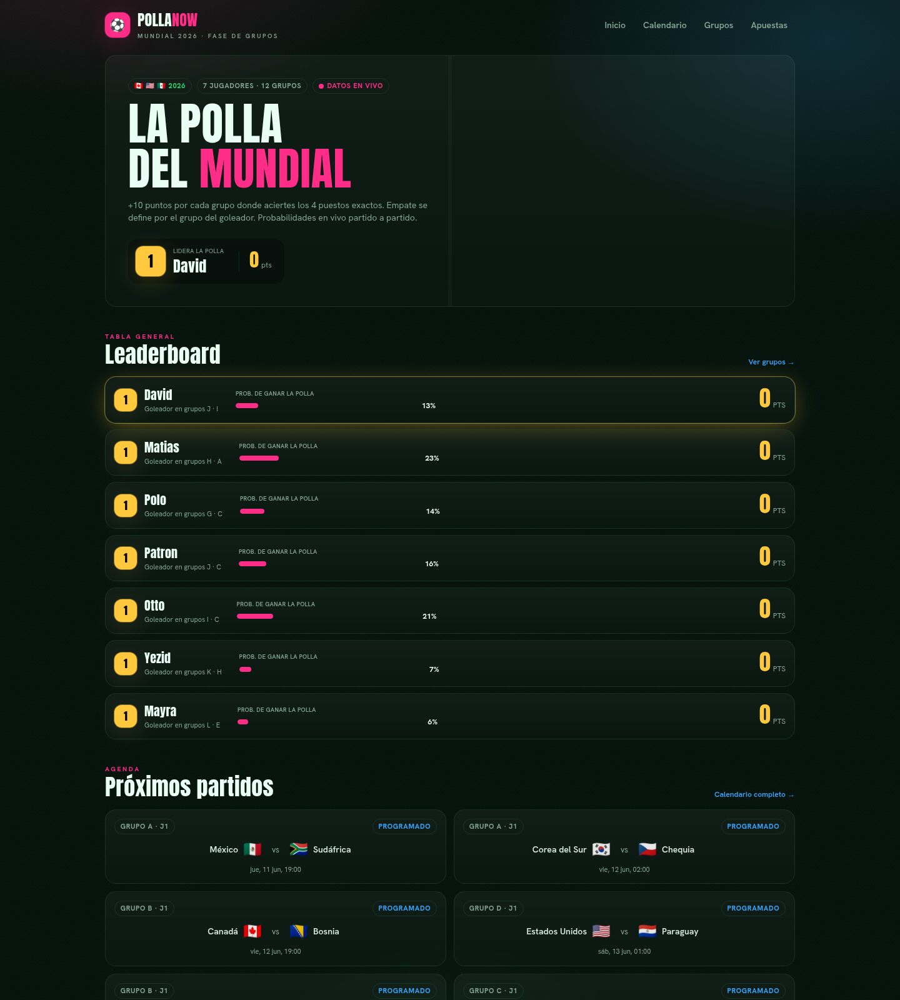
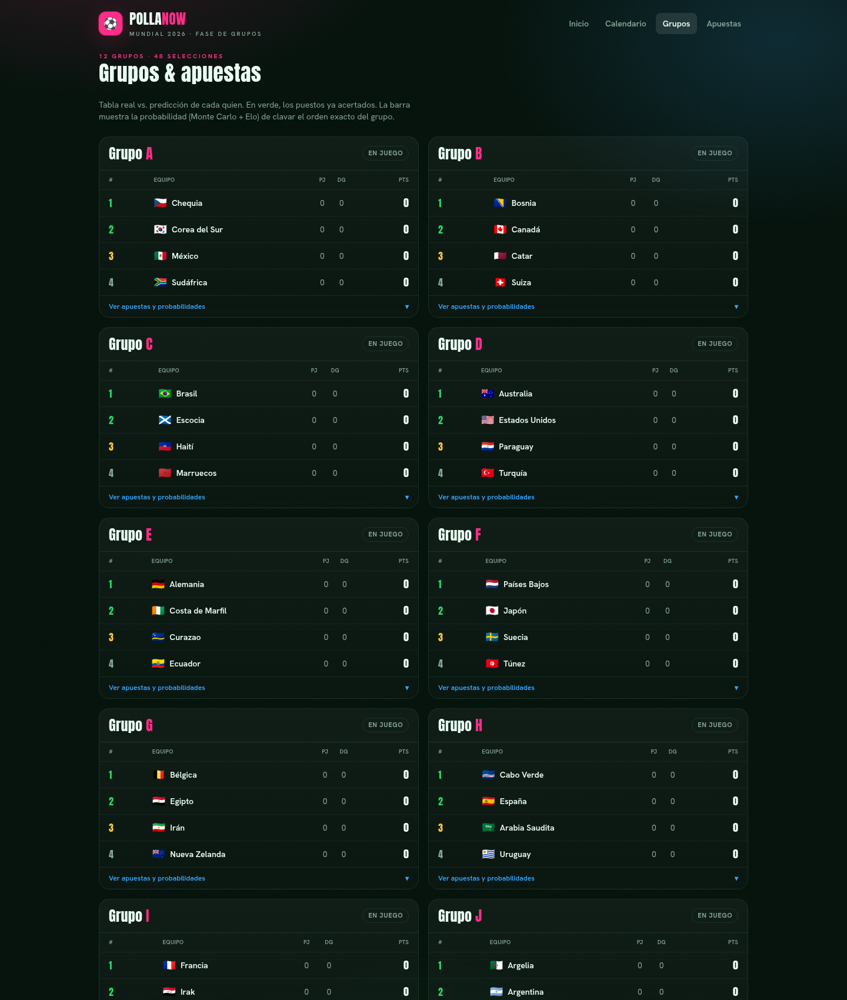
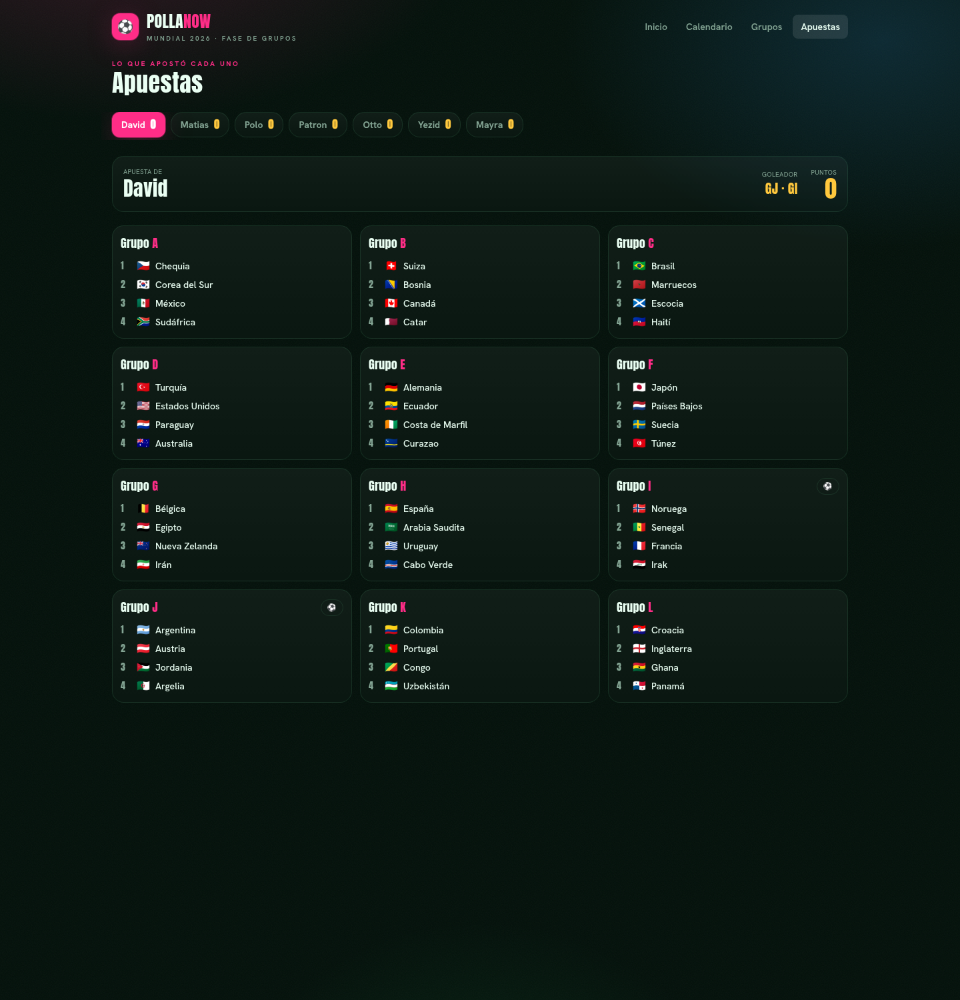
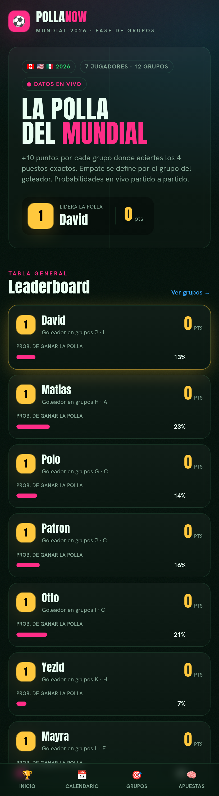
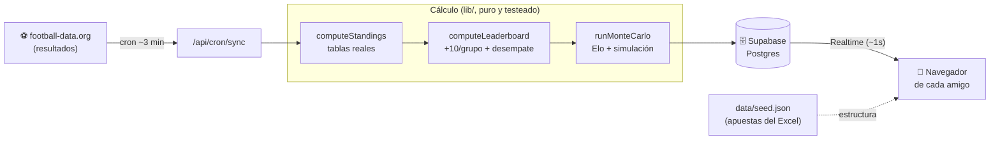
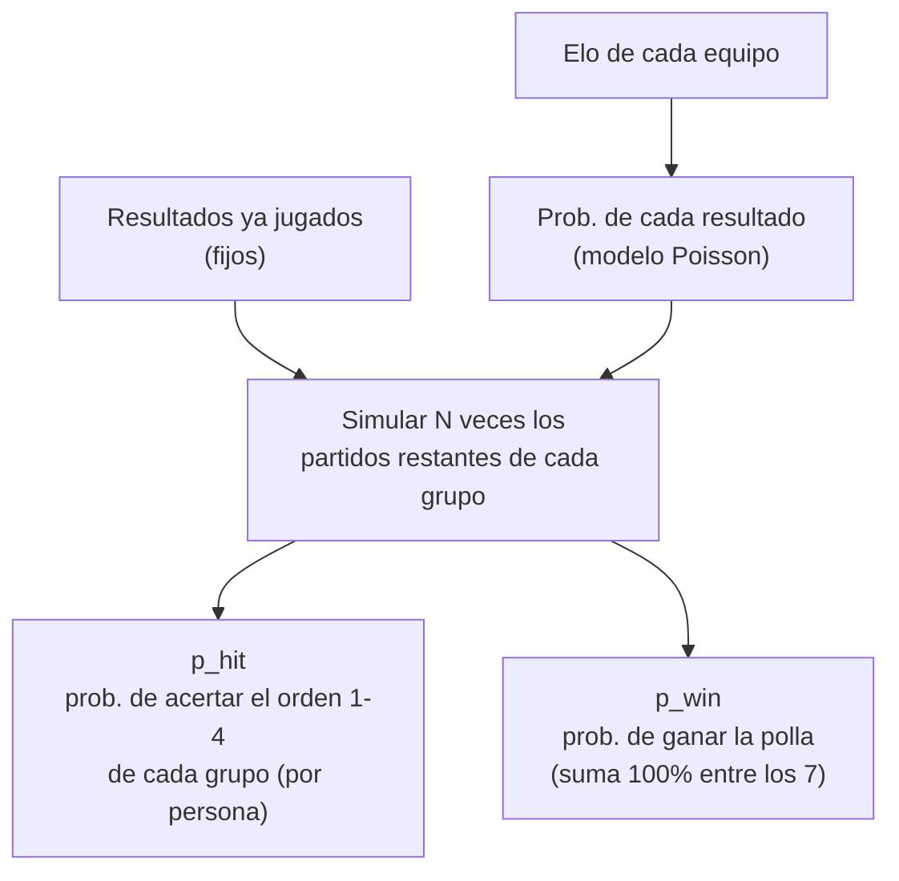

# ⚽ PollaNow — Mundial 2026

La polla de la **fase de grupos** del Mundial 2026 entre 7 amigos (David,
Matias, Polo, Patron, Otto, Yezid, Mayra). Cada uno predijo el orden 1º–4º de
los 12 grupos y eligió 2 grupos como apuesta de **de qué grupo saldrá el
goleador** (el desempate). La app muestra apuestas, calendario y resultados en
vivo, leaderboard y **probabilidades en tiempo real** (Elo + Monte Carlo).

- **Puntaje:** +10 por cada grupo con los 4 puestos exactos (todo o nada).
- **Desempate:** entre empatados, gana quien tenga el grupo del goleador real
  entre sus 2 elegidos.

🔗 **En vivo:** https://pollanow.vercel.app

## 📸 Capturas

| Inicio — leaderboard + prob. de ganar la polla | Grupos — tabla real vs. apuesta de cada uno |
|:---:|:---:|
| [](docs/screenshots/home.png) | [](docs/screenshots/grupos.png) |

| Apuestas — bracket por persona | Móvil (responsive) |
|:---:|:---:|
| [](docs/screenshots/apuestas.png) |  |

## Stack

- **Next.js 16** (App Router, TS) + **Tailwind** — UI responsive (PC/móvil).
- **Supabase** (Postgres + Realtime) — datos en vivo que se empujan al cliente.
- **football-data.org** — fixtures y resultados del Mundial (adaptador
  intercambiable en `lib/api/`).
- **Vercel** — hosting + Cron del sync.
- Lógica pura y testeada en `lib/` (`scoring`, `elo`, `montecarlo`).

## Cómo funciona

### Flujo de datos

Un cron externo (cada ~3 min) dispara el sync; los resultados se procesan y se
guardan en Supabase, que **empuja** los cambios a cada navegador abierto al
instante (Realtime).



La **estructura** (grupos, equipos, apuestas) vive en `data/seed.json`, generado
del Excel con `scripts/build_seed.py` y no cambia. Solo lo **dinámico**
(partidos, tablas, puntos, probabilidades) vive en Supabase.

### Cómo se calculan las probabilidades

Cada equipo tiene un rating **Elo**. Con él se estima la probabilidad de cada
resultado y se **simulan miles de veces** los partidos que faltan (los ya
jugados se fijan con su marcador real). Contando los resultados de esas
simulaciones se obtienen las dos probabilidades que ves en la app.



> A medida que se juegan partidos, hay menos por simular y las probabilidades se
> afinan; cuando un grupo termina, su `p_hit` es 0% o 100%.

## Puesta en marcha local

```bash
npm install
python3 scripts/build_seed.py     # regenera data/seed.json desde el Excel (opcional)
cp .env.example .env.local        # completa las claves
npm test                          # 27 tests de la lógica
npm run dev                       # http://localhost:3000
```

## Configurar Supabase

1. Crea un proyecto en [supabase.com](https://supabase.com) (plan gratis).
2. En **SQL Editor**, pega y ejecuta `supabase/migrations/0001_init.sql`
   (crea tablas, RLS de lectura pública y publicación Realtime).
3. Copia en `.env.local`: `NEXT_PUBLIC_SUPABASE_URL`,
   `NEXT_PUBLIC_SUPABASE_ANON_KEY` y `SUPABASE_SERVICE_ROLE_KEY`
   (Project Settings → API).
4. Carga las apuestas:
   ```bash
   npm run seed:load   # 7 jugadores, 48 equipos, 84 predicciones, 14 tiebreaks
   ```

## API de resultados (football-data.org)

1. Regístrate gratis en [football-data.org](https://www.football-data.org/client/register).
2. Pon el token en `FOOTBALL_DATA_API_KEY`.
3. Define un `CRON_SECRET` (string aleatorio largo) para proteger el endpoint.

Dispara un sync manual:
```bash
curl -X POST http://localhost:3000/api/cron/sync \
  -H "Authorization: Bearer $CRON_SECRET"
```

> **Nota del desempate (goleador):** el grupo del goleador se deriva del endpoint
> de goleadores de la API. Si el tier gratis no lo expone, ese dato queda en
> `null`; puedes fijarlo a mano en la tabla `tournament_meta`:
> `update tournament_meta set goleador_group = 'J', goleador_name = '...' where id = 1;`

## Desplegar en Vercel

1. Importa el repo en [vercel.com](https://vercel.com).
2. Agrega **todas** las variables de `.env.example` en Project → Settings →
   Environment Variables.
3. `vercel.json` define un Cron **diario** (`0 12 * * *`) — el máximo que
   permite el plan Hobby. Vercel añade solo la cabecera
   `Authorization: Bearer $CRON_SECRET` a las llamadas del cron. Para
   actualizaciones cada pocos minutos durante los partidos, usa el cron externo
   de la nota de abajo.
4. Deploy. Abre la URL en PC y móvil.

> **Frecuencia del Cron:** el plan **Hobby** de Vercel limita los crons (≈1/día).
> Para actualizar cada pocos minutos durante los partidos, crea un job gratuito
> en [cron-job.org](https://cron-job.org) que haga `GET` a
> `https://TU-APP.vercel.app/api/cron/sync` con la cabecera
> `Authorization: Bearer <CRON_SECRET>` cada 2–3 min.

## Estructura

```
app/                 # rutas: /, /calendario, /grupos, /predicciones, /api/cron/sync
components/          # Nav, Leaderboard, MatchCard, GroupCard, PredictionsView, ui
lib/
  scoring.ts         # tablas + puntos + desempate (puro, testeado)
  elo.ts             # prob. de resultado desde Elo
  montecarlo.ts      # simulación de grupos → probabilidades
  sync.ts            # orquestación del sync
  api/               # adaptador football-data.org + mapeo de equipos
  supabase/          # clientes server/browser
  data.ts            # capa de lectura para los Server Components
data/
  data-polla.xlsx    # Excel original
  seed.json          # datos transcritos (estructura + apuestas)
scripts/
  build_seed.py      # Excel → seed.json
  seed.ts            # seed.json → Supabase
supabase/migrations/ # esquema SQL
```
